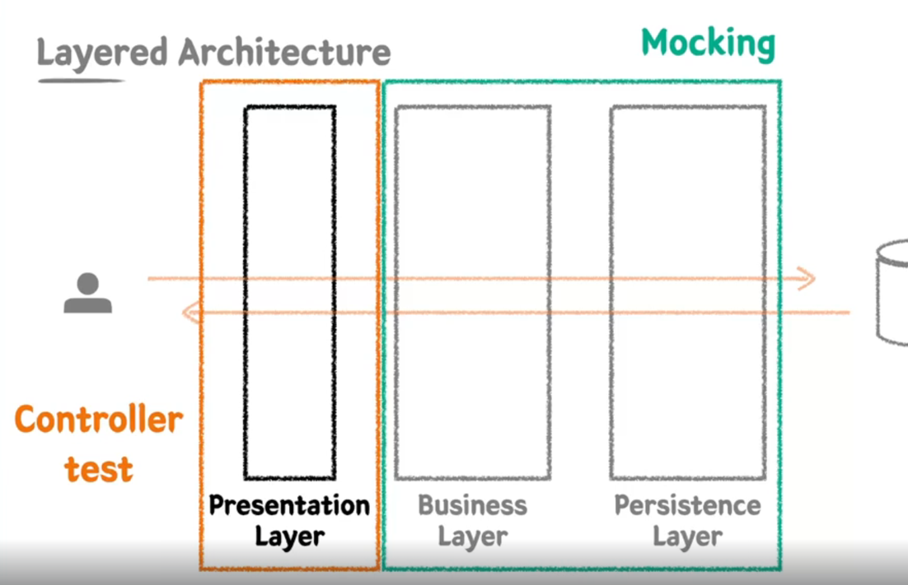

# 단위 테스트

- 작은 코드 단위(클래스 or 메서드)를 **독립적**으로 검증하는 테스트 (독립적->외부 의존하는 테스트가 아님)
- 테스트 기법 중 가장 작은 단위
- 검증 속도가 빠르고 안정적이다.

## JUnit

- 단위테스트를 위한 프레임워크

## AssertJ

- 테스트 라이브러리
- 풍부한 API, 메서드 체이닝 지원

# 테스트케이스 세분화하기

- 해피케이스, 예외케이스 -> 경계값 테스트가 중요

# 테스트하기 어려운 영역을 구분하고 분리하기

- 테스트코드 상에서 원하는 코드를 원하는 값을 넣어줄 수 있도록 설계를 변경하는 것이 중요하다.
- 외부로 분리할수록 테스트 가능한 코드는 많아진다..

```java
class Example {
    public Order createOrder(LocalDateTime currentDateTime) {
//        LocalDateTime currentDateTime = LocalDateTime.now();
        LocalTime currentTime = currentDateTime.toLocalTime();
        if (currentTime.isBefore(SHOP_OPEN_TIME) || currentTime.isAfter(SHOP_CLOSE_TIME)) {
            throw new IllegalArgumentException("주문 시간이 아닙니다. 관리자에게 문의하세요");
        }
        return new Order(currentDateTime, beverages);
    }
}
```

## 테스트하기 어려운 영역

- 관측할 때마다 다른값에 의존하는 코드 : 현재날짜, 시간, 랜덤값, 전역변수/함수, 사용자 입력 등
- 외부세계에 영향을 주는 코드 : 표준출력, 메시지 발송, DB기록 등..

## 테스트하기 쉬운 영역

- 순수함수 => 테스트하기 쉬운 함수
- -> 같은 입력에는 항상 같은 결과
- -> 외부 세상과 단절된 상태

## 단위테스트 키워드 정리

- 단위테스트
- 수동테스트, 자동화테스트
- Junit5, AssertJ
- 해피케이스, 예외케이스
- 경계값 테스트
- 테스트하기 쉬운영역(순수함수) / 어려운 영역
- cf) 롬복 -> @ToString은 순환참조문제 때문에 DTO에만 사용하는 편이다..

# TDD

- RED : 실패하는 테스트 작성
- GREEN : 테스트 통과 최소한의 코딩
- REFACTOR : 구현 코드 개선 테스트 통과 유지

## TDD 핵심가치 - 피드백

### 선기능 후 테스트 작성

- 테스트 누락 가능성
- 특정 케이스만 검증할 가능성 (해피케이스)
- 잘못된 구현을 다소 늦게 발견할 가능성

### 선테스트 후 기능 작성

- 복잡도가 낮은, 테스트 가능한 코드로 구현할 수 있게 한다
- 쉽게 발견하기 어려운 엣지 케이스를 놓치지 않게 해준다.
- 구현에 대한 빠른 피드백을 받을 수 있다.
- 과감한 리팩토링이 가능해진다.

### TDD - 관점의 변화

- 기존 테스트는 구현부 검증을 위한 보조 수단이었다면
- TDD는 테스트와 상호작용하며 발전하는 구현부..
- -> 클라이언트(내가 만든 객체를 사용하여 개발하는 입장) 관점에서 피드백을 주는 TDD

## TDD 키워드 정리

- TDD
- 레드-그린-리팩토링
  cf)
- 애자일(vs폭포수)
- 익스트림 프로그래밍
- 스크럼, 칸반

# 테스트는 문서다

- 프로덕션 기능을 설명하는 테스트 코드 문서
- 다양한 테스트 케이스를 통해 프로덕션 코드를 이해하는 시각과 관점 보완
- 모두의 자산으로 승격시킬 수 있다

## DisplayName을 섬세하게

- 명사의 나열보단 문장으로 ('~~테스트' 지양)
- A면 B이다
- A면 B가아니고 C이다
- ex) 음료를 하나 추가하면 주문목록에 담긴다 -> 테스트 행위에 대한 결과까지 기술
- ex) 특정시간이전에 주문을 생성하면 실패한다. -> '영업시작시간' 이전에는 주문을 생성할 수 없다. -> 도메인 용어를 사용하여 한층 추상화된 내용 담기
- -> 메서드 관점 자체보다 도메인 '정책' 관점으로!
- -> 테스트 현상을 중점으로 기술하지 말것(~하면 실패한다. -> 실패는 테스트의 현상이지 도메인 용어가 아니다)

## BDD 스타일로 작성하기

- behavior driven development
- tdd에서 파생된 개발방법
- 함수단위의 테스트에 집중하기보다 시나리오에 기반한 테스트 케이스 자체에 집중하여 테스트
- 개발자가 아닌 사람이 봐도 이해할수 있을 정도의 추상화 수준을 권장함.

### given / then/ when

- given : 시나리오에 필요한 모든 준비 과정(객체, 값, 상태 등)
- when : 시나리오 행동 진행
- then : 시나리오 진행에 대한 결과 명시, 검증 
- 어떤환경에서(given) 어떤행동을 했을때(when) 어떤일이 일어난다(then) -> displayName 명확하게 작성할 수 있다

## 테스트는 문서다 키워드 정리
- @DisplayName - 도메인 정책, 용어를 사용한 정확한 문장으로 사용하기
- given / when / then
- TDD vs BDD
cf) JUnit vs Spock. 

# Spring & JPA 기반 테스트 
## 레어이드 아키텍처 -> 관심사의 분리! 
## 통합테스트
- 여러 모듈이 협력하는 기능을 통합적으로 검증하는 테스트
- 일반적으로 작은 범위의 단위 테스트만으로는 기능 전체의 신뢰성을 보장할 수 없다
- 풍부한 단위테스트 & 큰 기능 단위를 검증하는 통합테스트\

## 리포터지토리 테스트
- 퍼시스턴스 레이어만 테스트하면 됨
### 퍼시스턴스 레이어
- DataAccess의 역할
- 비즈니스 가공 로직이 포함되어서는 안된다
- Data에 대한 CRUD만 집중한 레이어

## 서비스 테스트
- 퍼시스턴스 레이어와 비즈니스 레이어를 통합하여 테스트
### 비즈니스 레이어
- 비즈니스 로직을 구현하는 역할
- 퍼시스턴스 레이어와 상호작용을 통하여 비즈니스 로직을 전개시킨다
- 트랜잭션을 보장해야한다

# Presentation Layer
- 외부세계의 요청을 가장 먼저 받는 계층
- 파라미터에 대한 최소한의 검증을 수행한다.
## 프레젠테이션 레이어 테스트

- 비즈니스 레이어와 퍼시스턴스 레이어를 모킹처리하여 테스트한다.
## MockMvc
- mock(가짜)객체를 통해 스프링 MVC의 동작을 재현할 수 있는 테스트 프레임워크
- 